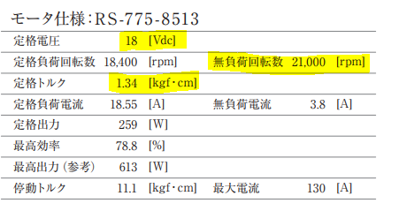
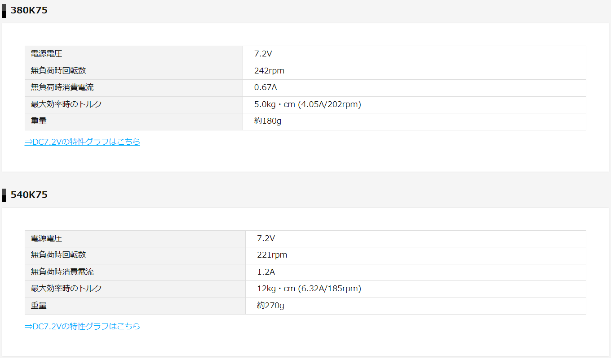
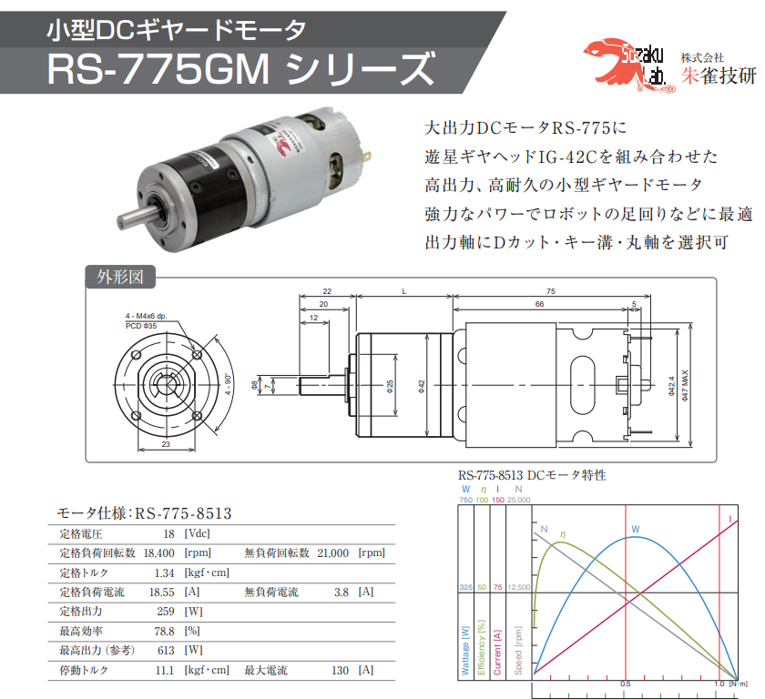
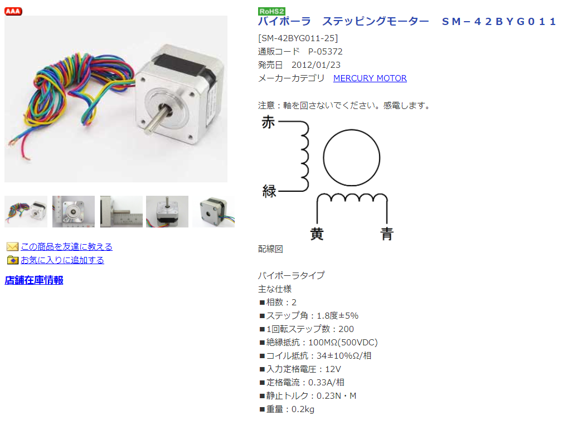
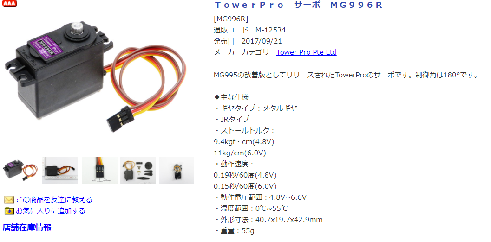
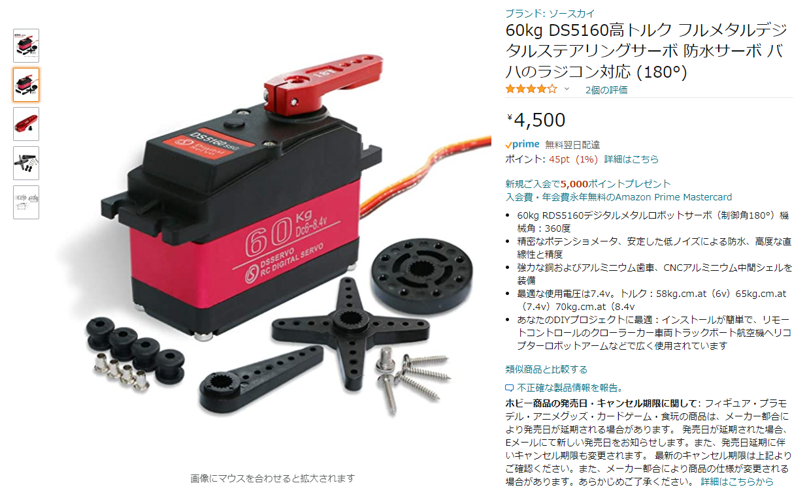
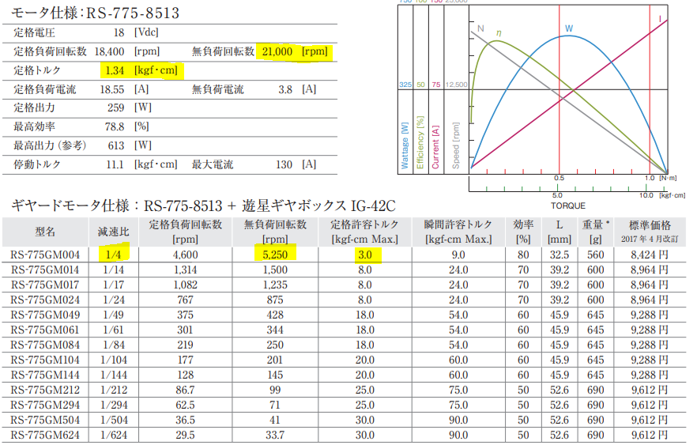
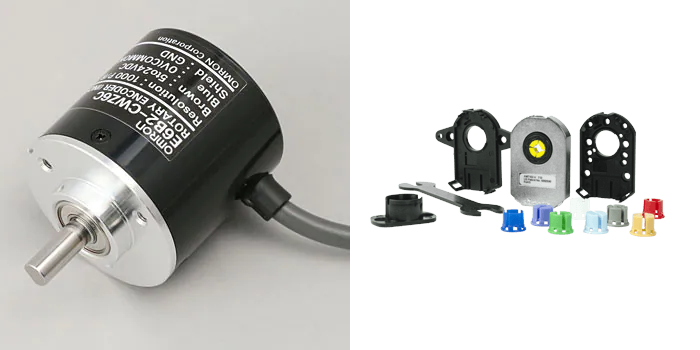

# アクチュエータについて

## カタログの読み方

モータの選定時には注意すべき点がいくつかあります

以下には特に注意すべき3つの項目を挙げますので、選定の参考にしてください

* V : 定格電圧
* rpm : 無負荷回転数
* Nm : 定格トルク (1N = 0.1kgf)

実際のカタログでは上の表のようにまとめられています

無負荷回転数と定格負荷回転数の違いについては、特に気にしなくても良いですが、実際の回転数は無負荷回転数より少なくなることに注意しましょう

## モータの種類

ロボコンなどで使われるモータは4種類あります

1. ブラシ付きDCモータ　2. ブラシレスDCモータ　3. ステッピングモータ　4. サーボモータ

この中でブラシ付きDCモータは減速機といわれるものをつけて利用されることが非常に多いです

※減速機については後述します

### ブラシ付きDCモータ（DCモータ）

DCモータといわれるもので、一般的にモータといわれるとこれを想像する人が多いです

当サークルでよく使われるDCモータは3種類あり、トルクの大きい順に、

朱雀775、タミヤ540、タミヤ380で、
それぞれのスペックは以下のとおりですので、カタログの読み方を参考に確認しておいてください

 

※スペックを見比べて、不思議に思った人もいると思いますがタミヤ380と540のスペック表は減速比を1:75にした場合なので、モータのみの場合と比較することはできません

### ブラシレスDCモータ

当サークルでは、いつか使いたいと画策しているもので、速度制御の面などで大きな利点があり、電気自動車などに利用されています

※ブラシレス、ブラシ付きについてもっと知りたい方は各自で調べてください

### ステッピングモータ

通常のDCモータの場合、特殊な測定器具（エンコーダなど）によって、モータがどれほど回転したかをフィードバックすることで制御しますが、ステッピングモータはそういった器具なしに相対的であれば制御が可能なモータです

想定以上の負荷がかかった場合、うまく回転しない（脱調）ことがあるので注意しましょう

基本的には秋月電子で購入することが多く、
実際に調べてみるとバイポーラとユニポーラの2つの種類がありますが、基本的にはバイポーラを使います

定格が12Vの場合、SM-42BYG011がおすすめです

### サーボモータ

サーボモータはエンコーダなしに絶対的な制御が可能となるモータですが、回転角に限度があるので注意しましょう

注）ローテーションサーボは厳密にはサーボモータではありません！！

また、負荷のかかるところにはプラスチック製ではなく、メタル製のギアを用いることを心がけましょう

個人的におすすめのサーボモータはMG996Rで、メタル製のギア、回転角は180°となっています

 さらにトルクの大きいサーボモータに60㎏サーボというのがあります
 

## 減速機

DCモータ単体ではトルクがいまいち足りないことが多々あるので、減速機を用いて回転数を減らし、代わりにトルクを大きくすることができます

ここで減速機の1種で、これからたびたびお世話になるギヤボックスについて紹介します

ギヤボックスとは、ギヤといわれる歯車をいくつか噛み合わせ、ギヤ比といわれるものを変化させます

（ギヤボックスのついたモータのことを普通ギヤードモータといいます）

どれほどトルクや回転数が変化するかはギア比によってわかります！

今回のは定格許容トルクのため、トルクは単純に4倍とはなりませんが、トルクが大きくなっていることが分かります

## エンコーダ（ロータリエンコーダ）

当サークルで使うロータリエンコーダは2種類あり、左の軸ありエンコーダはギアを一度かませることが必要ですが、右のホール型のエンコーダは軸にそのままさすことでも利用できます

手軽に利用でき、安価なエンコーダとしては右のタイプの[AMT102-V](https://www.digikey.jp/ja/products/detail/cui-devices/AMT102-V/827015)がおすすめです

ほかのサイトでも売られているので、値段と納期で比較してどこで買うかを決めましょう

## 参考文献

* https://media.suzakugiken.jp/suzaku/catalogue/catalog_dcgm_RS775GM.pdf
* https://ev-tech.jp/technology/motor/page001.html
* https://www.tamiya.com/japan/robocon/topics/gearedmotor170928.html
* https://www.orientalmotor.co.jp/om/knowledge/uroko_bl/bl02.html
* https://akizukidenshi.com/catalog/g/gP-05372/
* https://www.digikey.jp/ja/products/detail/cui-devices/AMT102-V/827015
* https://www.monotaro.com/g/00161736/
