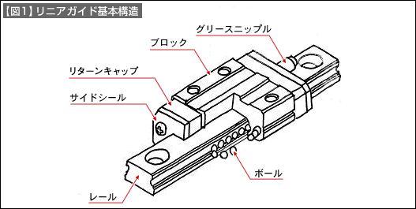
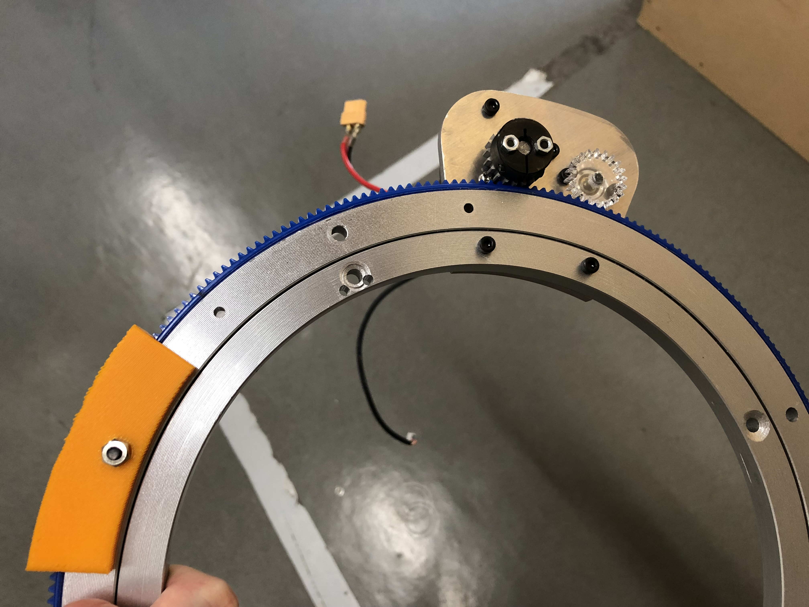

# 第３回「主駆動機構（１）」

第３回と第４回では駆動機構を扱っていきます。今回は、大きく分けて直動機構と回転機構の２つをご紹介します。

# 1. 直動機構
## 直動機構とは？
文字通り、直線上にものを動かすための機構です。直動機構は主にモーターが取り付けられた駆動部分と動かす方向に伸びたレールから成っています。
ロボコンでは、主に「ラックピニオン」「エアシリンダー」「ベルトプーリー」「ボールネジ」などの機構がよく用いられています。ここでは、これら4つに関し、参考例を見ながら理解を深めていきましょう。

## ラックピニオン
### 基礎事項
ピニオン（小さいギア）とラックにによって構成される直動機構です。まずは下のアニメーションをご覧ください。

（http://karakurist.jp/?p=24 より引用）

これが、ラックピニオンです。仕組みは簡単ですね。ピニオンが回ることによってラックが直動運動をする機構です。もちろんラック側を固定してピニオンを回せばピニオン側を直動運動させることができます。

仕組みは簡単なのですが、ロボットに組み込もうとすると設計が複雑になりがちなのがラックピニオンの特徴です。下の画像をご覧ください。

%201.png)

この機構はNHKロボコン2022にて僕が設計した伸縮機構です（今見るともっと軽量化するべきだったと後悔しています笑）。青色の部分がラック、右側のギアについているのがDCモーター、左側のギアについているのがエンコーダーとなっています。この機構が複雑になる理由として挙げられるのが、自作レール部分です。角柱の4方向からベアリング（回転をスムーズにするための車輪のようなものだと思ってください。第４回 [主駆動機構（２）]() にて詳しく説明します）で押さえつけているため少し大掛かりな構造となっています。

### 余談
この機構が大きくなっている理由としてx軸方向のベアリングとして比較的サイズの大きい戸車（網戸の車輪などに使われるもの）を利用していることが挙げられます。アルミ丸棒に加工することができれば、以下のように省スペース化してレール部分を作成することもできるようですが、僕の知る限り、ロ技研では加工したことがありません。

（https://qiita.com/haxhimitsu/items/b15a2ed363ef052e7b2d より引用）

### ガイドレールについて
さて、ここまでレールは作成しないといけないもののように説明してきましたが、実は既製品が存在します。既製品を使うのか、それとも自作するのかの判断については、使用目的と値段との兼ね合いで決定しましょう。

MiSUMiでリニアガイドレールと検索してみてください。すると、下の画像のようなレールが出てくると思います。

%201.png)

リニアガイドレールは多くの直動機構に用いられる信頼性の高いレールです。それゆえ値段も高いです。基本的な構造は以下の画像ようになっています。

（https://jp.misumi-ec.com/tech-info/categories/machine_design/md01/c1087.html より引用）

ボールがブロックの中を出たり入ったりすることによってレールとの摩擦を減らし、スムーズに直動するという仕組みです。
このリニアガイドレール以外にも、価格を抑えたリニアガイド型のレールやスライドレールと呼ばれる部品もあります。MiSUMiで検索して実際に確かめて理解を深めてみてください。

## エアシリンダー
### 基礎事項
直動機構の中で最も単純な機構がエアシリンダーを用いた機構です。エアシリンダーのストロークをそのまま直動の動きとして動作させます。

ただし、エアシリンダーによる直動機構には注意点があります。エアシリンダーはエアを入れたり出したりすることで伸縮するため勢いよく動作します。このため、頑丈な構造をとらないと機構が壊れてしまう可能性があるということを覚えておきましょう。

また、エアシリンダーには「伸ばす」「縮める」の2パターンしかないため、途中で止めることが難しいという点も覚えておくと良いと思います。

ではここで、下の画像をご覧ください。シリンダーのストロークを直接直動運動として利用している例です。

%201.png)

（https://jp.misumi-ec.com/ec/incadlibrary/detail/000035.html より引用）

この画像をよくみていただくと、この機構にもリニアガイドが使用されていることが分かります。せっかくなので詳細をよく確認するために、ここでCADデータをダウンロードしてみましょう。

CADデータをダウンロードするとCAD上で仕組みを確認することができるため便利です。

### CADデータのダウンロード方法
長くなるので別の記事にまとめました。 [こちら](download_cad.md) をご覧ください。

### エアシリンダーのストローク増幅方法
滑車を組み合わせて使うことにより、エアシリンダーのストロークを増幅させることもできます。

以下の画像をご覧ください。これは滑車を用いてエアシリンダーのストロークを4倍にまで伸ばしている機構の例です。

（https://jp.misumi-ec.com/ec/incadlibrary/detail/000701.html より引用）

どのように動作するのかを確認するために、ここで一度リンクにアクセスして動画を再生してみましょう。かなり複雑な設計になっていますが、どのような仕組みで動作しているのかは理解できると思います。

## ベルトプーリー
### 基礎事項
ベルトプーリーは、タイミングベルトとプーリー、アイドラーによって構成される、主に昇降装置に使われる機構です。エレベーターの仕組みを想像していただくと分かりやすいと思います。

以下の画像をご覧ください。

（https://jp.misumi-ec.com/ec/incadlibrary/detail/000425.html より引用）

### タイミングベルトとプーリー、アイドラー
タイミングベルトとは、内側に歯のついたベルトのことです。通常、プーリーという歯の形で凹んだ部品と組み合わせて使用します。アイドラーとは、従動回転させるプーリーのことで、モーターに取り付ける方がプーリー、自由回転する方がアイドラーです。形の詳細は下の画像を参考にしてください。左側がタイミングベルトで右側がプーリーです。アイドラーは違うものもありますが、プーリーと似た形をしています。

%201.png)

## ボールネジ
### 基礎事項
ボールネジは、ねじ軸とナットなどによって構成される、回転を直動運動に変換する機構です。プリンターの内部構造を見たことがある方は想像しやすいかもしれません。

ねじ軸とは軸となる棒の部分、ナットとはねじ軸の回転によって実際に直動運動する部分です。

以下の画像をご覧ください。これが、プリンターなど精度が要求されるものによく採用される、平面を自由に動かすことができるボールネジ機構です。

%201.png)

（https://jp.misumi-ec.com/ec/incadlibrary/detail/000031.html?clkid=clkid_incad_case_oth1_sc640_201910 より引用）

一方で、動作は比較的遅い傾向があります。動画で確認してみましょう。 [こちら](https://ja.aliexpress.com/item/32677434582.html?spm=a2g0o.productlist.0.0.9ba63ba0ORba4b&algo_pvid=1952bd5c-735f-4e04-b6ba-a2a0a190e79a&algo_exp_id=1952bd5c-735f-4e04-b6ba-a2a0a190e79a-8&pdp_ext_f=%7B%22sku_id%22%3A%2212000025074729628%22%7D&pdp_pi=-1%3B4766.0%3B-1%3B255.0%40salePrice%3BJPY%3Bsearch-mainSearch) のAliExpressの商品紹介ページにアクセスして動画を再生してみましょう。

このページの動画で紹介されているのは3次元のどの方向にも移動できるボールネジ機構です。このように、動作は遅いですが精度の高い動きができることがボールネジの特徴です。

# 2. 回転機構
## 回転機構とは？
文字通り、ものを回転させる機構のことです。
ロボコンでは、主に「歯車（ギア）」「ベルトプーリー」「自作回転台」などの機構がよく用いられます。ここでは、これら4つに関し、参考例を見ながら理解を深めていきましょう。

## 歯車（ギア）
### 基礎事項
皆さんが想像するような一般的な歯車をロボコンでも使います。歯車にはモジュールと呼ばれる規格があり、同一のモジュールであれば組み合わせて使うことができます（モジュールが同一かどうかだけを意識していれば基本的には問題ないです）。

ギアは組み合わせて使用することで、回転速度とトルクを調節することができます。下の画像を例に考えていきましょう。

%201.png)

この機構では歯数20のギアと歯数60のギアが組み合わさっています。

この状態で歯数20のギアにモーターを繋いで回転させた場合、歯数60のギアの回転速度は1/3倍となりますがトルクは3倍に上がります。

逆に、歯数60のギアにモーターを繋いで回転させた場合、歯数20のギアのトルクは1/3倍となりますが回転速度は3倍に上がります。

このように、ギアを組み合わせることによって回転速度とトルクを任意の倍数に変化させることができます。もし、以下の画像のように組み合わせ、一番左の歯数20のギアにモーターを繋いで回転させた場合、一番右の歯数60のギアの回転速度とトルクはどうなるでしょうか。

%201.png)

一番左の歯数20のギアは一旦歯数60のギアを噛み、その歯数60のギアに取り付けられた歯数20のギアが一番右の歯数60のギアを回すことになるので、回転速度は1/9倍に、トルクは9倍になりますね。

このようなギアの端数の比率のことを「ギア比」もしくは「減速比」と言います。

バッティングセンターのボールを射出する機構など回転を上げたい場合にはギア比を低くし、微調節が必要な機構に取り付ける場合にはギア比を高くするなど多くの場面で用いられます。

### ギアの噛み合わせ
ギアとギアを組み合わせるときの距離はギアの歯数によって決まります。歯数20のギアと歯数60のギアを組み合わせる場合には、直径20mmの円と直径60mmの円が接するように設計することで噛み合わせることができます。

つまり、以下の画像のようなことが成り立ちます。

%201.png)

ギアの噛み合わせの設計をする際などに参考にしてみてください。ではどうして噛み合うのかと気になった方は次の項目の「ギアの設計」についてを読んでみてください。

### ギアの設計（参考）
ギアのSOLIDWORKSでの設計については、ロ技研の先輩が記事でまとめています。気になる方は [こちら](https://keiorogiken.wordpress.com/2017/12/17/%e6%ad%af%e8%bb%8a%e3%81%ae%e5%9f%ba%e7%a4%8e/) をチェックしてみてください。

## ベルトプーリー
### 基礎事項
基本的に用いられ方はギアと同じです。ただし、歯車とギアには大きく以下の2つの違いがあります。

* ギアは互いが決まった距離感でなければ成らないのに対し、ベルトプーリーは互いが離れていても減速比を変えた機構を製作することができる

* ギアは駆動側と従動側で反対方向で回転するのに対し、ベルトプーリーは駆動側と従動側で動位置の方向に回転する

実際に動画で解説されているものがあるので [こちら](https://www.youtube.com/watch?v=s7oVTGv9uy4&t=85s) で確認してみましょう。

軸間距離が長く取れるというのは、やはり昇降装置にて活躍すると思います。エレベーターなどにも似たような機構が採用されているので、興味がある方は調べてみてください。昇降などの直動機構を作成する際にはモーターをなるべく動かさないということも大切な要素となってくるので、そのような場合にベルトプーリーは威力を発揮します。

## 自作回転台
### 基礎事項
自作回転台とは、中華回転テーブルなどに用いられる回転台（ターンテーブル）などを用いた回転機構のことです。もちろん、ターンテーブルを利用しないで3Dプリンターなどですべて自作することもできますが、ここでは実際に僕が作った回転台を例に仕組みを見ていきましょう。

以下の画像をご覧ください。自作回転台の構造はこのようになっています。

回転台の外側にラックを貼り付け、内側を固定することで外側をモーターで回転させることができます。これは特に大きな機構を回転させる時などに有用で、ロ技研では過去の大会でも多く使用しています。

要するに、直動機構で紹介したラックピニオンを回転機構に組み込んだというものです。

ただし、設計で少し難しいポイントがあります。それは、円に穴を開けることになるため、ルートが出てきてしまう点です。また、加工の際にも細かい小数が出てきてしまうため大変です。工場や加工についての詳細は、第６回 [加工について]() にてご紹介します。

# 3. 参考文献・引用文献
* ラックピニオンのアニメーション：

    http://karakurist.jp/?p=24

* 小型ラックピニオン直動機構：

    https://qiita.com/haxhimitsu/items/b15a2ed363ef052e7b2d

* リニアガイドレールの仕組み：

    https://jp.misumi-ec.com/tech-info/categories/machine_design/md01/c1087.html

* エアシリンダー直動機構：

    https://jp.misumi-ec.com/ec/incadlibrary/detail/000035.html

* エアシリンダーストローク増幅方法：

    https://jp.misumi-ec.com/ec/incadlibrary/detail/000701.html

* ベルト駆動直動機構：

    https://jp.misumi-ec.com/ec/incadlibrary/detail/000425.html

* ボールネジ直動機構：

    https://jp.misumi-ec.com/ec/incadlibrary/detail/000031.html?clkid=clkid_incad_case_oth1_sc640_201910

* AliExpressボールネジ商品紹介ページ：

    https://ja.aliexpress.com/item/32677434582.html?spm=a2g0o.productlist.0.0.9ba63ba0ORba4b&algo_pvid=1952bd5c-735f-4e04-b6ba-a2a0a190e79a&algo_exp_id=1952bd5c-735f-4e04-b6ba-a2a0a190e79a-8&pdp_ext_f=%7B%22sku_id%22%3A%2212000025074729628%22%7D&pdp_pi=-1%3B4766.0%3B-1%3B255.0%40salePrice%3BJPY%3Bsearch-mainSearch

* ギアの設計方法：

    https://keiorogiken.wordpress.com/2017/12/17/%e6%ad%af%e8%bb%8a%e3%81%ae%e5%9f%ba%e7%a4%8e/

* ベルトプーリーとギアの違い（動画）：

    https://www.youtube.com/watch?v=s7oVTGv9uy4&t=85s

# 4. 第3回設計課題
今回の設計課題については [こちら]() をご覧ください。

[ホーム](index.md)　　　[第2回]()