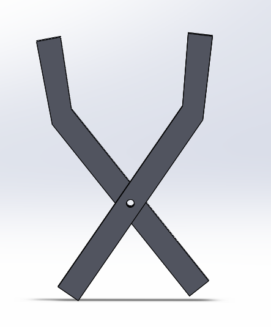
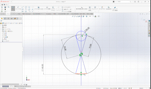
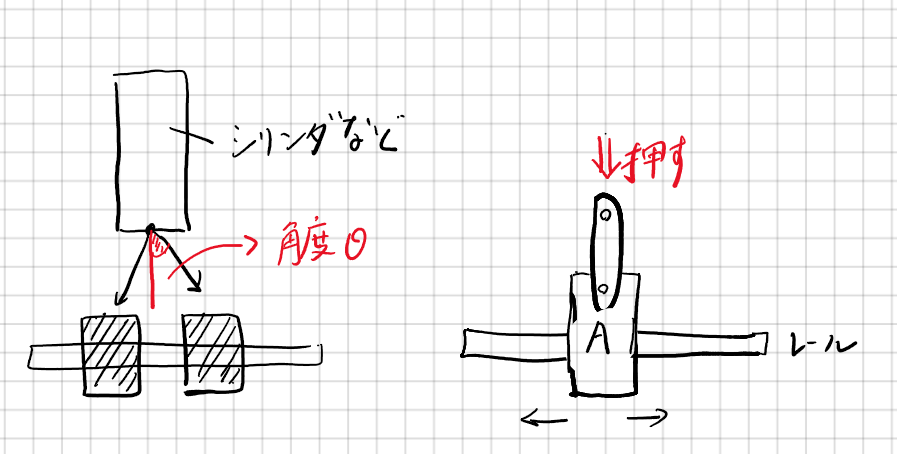

# 第４回「主駆動機構（２）」

前回に引き続き、主駆動機構を扱っていきます。今回は、回転軸とリンク機構の２つをご紹介します。

# 1. 回転軸
あいうえお

# 2. リンク機構
リンク機構は設計の幅を広げてくれる重要な機構要素の一つです
例えば、電車のパンタグラフなど日常生活でも目にすることが多いと思われます

ロボットの分野では、特にロボットハンドに利用されることが多い印象です

設計時は数値計算等を行うというよりも、CADソフトなどを利用してシミュレーションしてみたり、実際に試作品を作ったりして実際に動くかを確かめるような手探りの作業になります

<iframe width='694' height='420' src='https://www.youtube.com/embed/ASsioh8asQo' title='YouTube video player' frameborder='0' allowfullscreen=></iframe>

## 必要なもの

* リンク本体部分（板部分）
* ジョイント部分

特にジョイント部分には普通のねじで結ぶこともあれば支点用段付きねじというものを使う場合もあります

滑りの良さとしては、

普通のねじ　＜　段付きネジ　＜　段付きネジ＋ベアリング

（場合によってはヒンジピンといわれるものを使うこともあります）

通常は段付きねじを利用します

## リンク機構の例

* 平行クランク（リンク機構ではなくクランク機構という意見もあります）

平行移動が可能です

<iframe width='694' height='420' src='https://www.youtube.com/embed/Gmh11809j1I' title='YouTube video player' frameborder='0' allowfullscreen=></iframe>

* 簡単なハンド

ハサミの構造と同じですが、最も簡単なリンク機構を用いたハンドとなります

右ではそのモデル化をし、シミュレーションしてみました

このハンドの場合、利用するアクチュエータは恐らく空圧になり、シリンダのストロークによりハンドの開閉が行われます

 

* [より実用的なハンド](https://jp.misumi-ec.com/ec/incadlibrary/detail/000835.html)

この機構よくよく見れば、このページの一番上のリンク機構によるハンドと実質的な構造は変わりませんが、先端の部分にレールを敷くことで、より動きやすくなっている点がいいと思われます
.png)

* おまけ　疑似歩行リンク

まるで歩行している可能ように見えるリンクです
https://twitter.com/i/status/1246614778392576000

他の疑似歩行リンク

---

＜注意事項＞

リンクの設計の際に、注意しなくてはいけないことがあります

それはリンクはある種、力のベクトルを変えるものとも捉えることができ、力のベクトルの変化が90°の場合、想定した動きをしない可能性があるということです

上の図では、θが90°や180°に近い場合、うまく機能しない可能性があります

というのも、右側のリンク機構を見ればわかりますが、この状況で押した場合モジュールAは右と左どちらに動くでしょうか？

詳しくは**自由度**や**対偶**等の用語を使って説明されますが、ここでは割愛したいと思います

 よって、リンク機構の設計及び利用する際には、リンクには回転角度に限界があることに注意しましょう！

## 参考文献

* [リンク機構の例一覧【40動画以上】 - 機械設計学習館](https://md-study.com/link-mechanism/#i-20)
* [支点段付ねじ　六角穴 \| ミスミ \| MISUMI-VONA【ミスミ】](https://jp.misumi-ec.com/vona2/detail/110302642870/?list=PageCategory)
* https://d-engineer.com/kikaiyouso/link.html
* http://karakurist.jp/?p=52
* [【部品組合せテンプレート】 リンクを用いた簡易位置決め機構 \| inCAD Library (misumi-ec.com)](https://jp.misumi-ec.com/ec/incadlibrary/detail/000835.html)
* https://twitter.com/UniverCurious/status/1246614778392576000