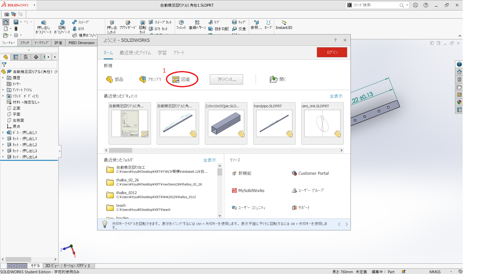
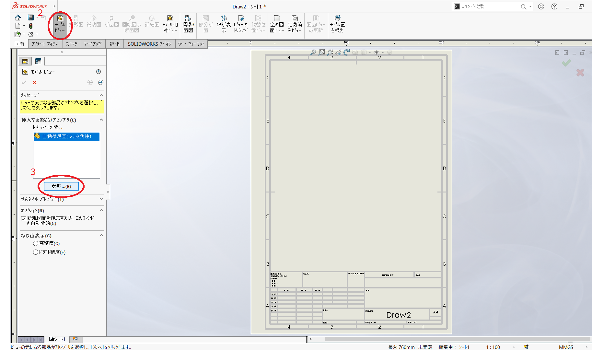
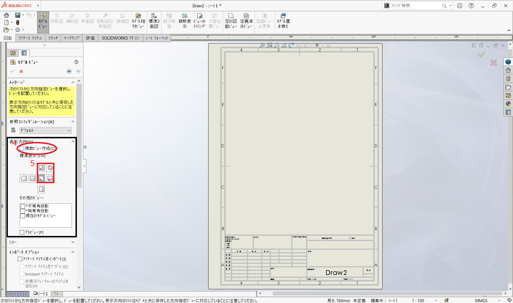
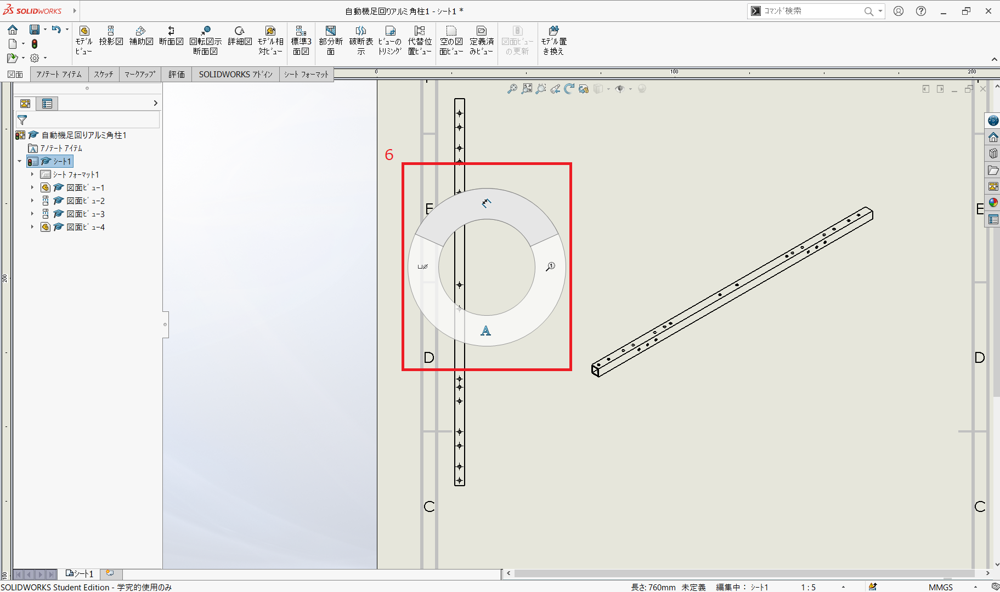
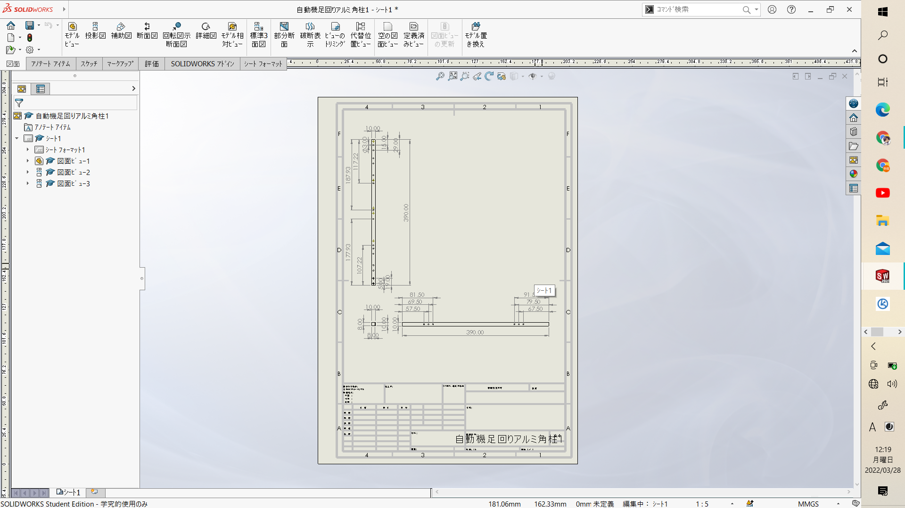
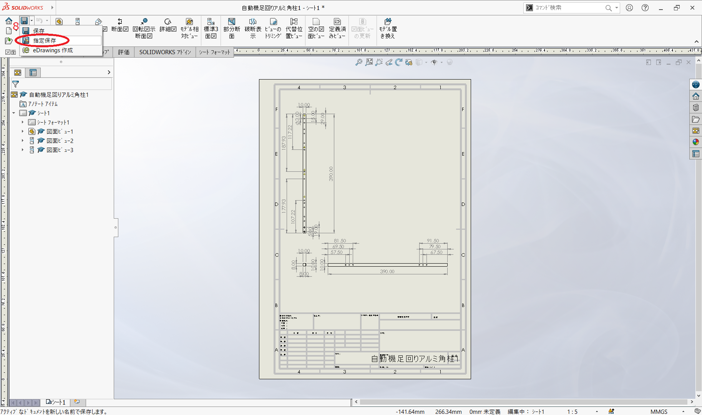
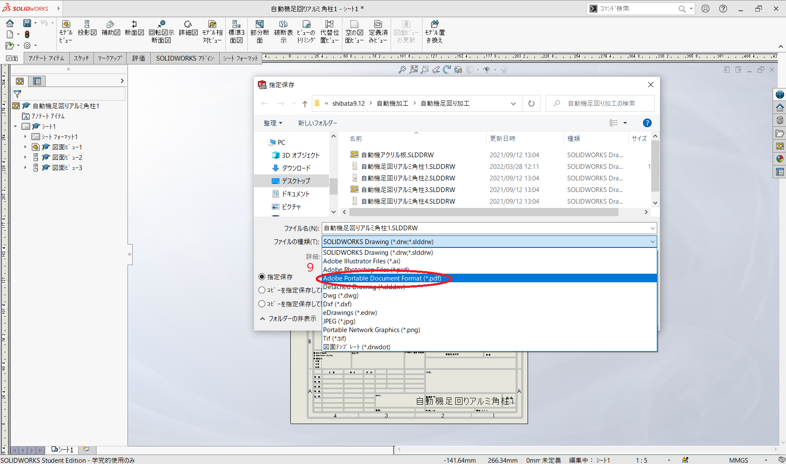

# 第5回「図面の作成と加工時の基本作法」

## 1. SolidWorksによる図面の作成方法
1. ホームより図面をクリック（ほかの経路もあります）

2. 左上のモデルビューを選択し

3. 参照を選択します（挿入する部品やアセンブリがすでに表示されている場合もあります）

4. 複数ビューの作成にチェックを入れ、

5. 赤い四角形で囲まれたものをすべて選択します（ここはお好みで表示向きの追加・削除をしてください）

6. 右クリック長押しでカーソルを上のほうにフリックすると、簡単に寸法モードになります

7. あとは必要な箇所に寸法をふっていきます　　　　　　　　　　　　　　　　　　　　　　　　　　　必要な箇所は（角柱の場合）

   * 全体の長さ
   * 角柱の横のサイズ（今回ならば10x10）
   * 穴の大きさ
   * 穴の位置（対称であれば、一方を省略してもいいです）

   そのほか、加工時に必要な寸法があれば、記入します

8. 右上の保存ボタンの横にある逆△で開いて、指定保存を選択します

9. ファイルの種類をPDFにすれば、印刷が容易なファイル形式になります
   加工当日までに紙で図面を用意するといいでしょう

　ちなみにファイルはPDF形式とsolidworksの図面形式（SLDDRW）2つあると変更時に図面を修正しやすいので、図面形式を捨てないように注意しましょう

PDF形式：編集不可

図面形式：編集可

## 2. 加工時の基本作法